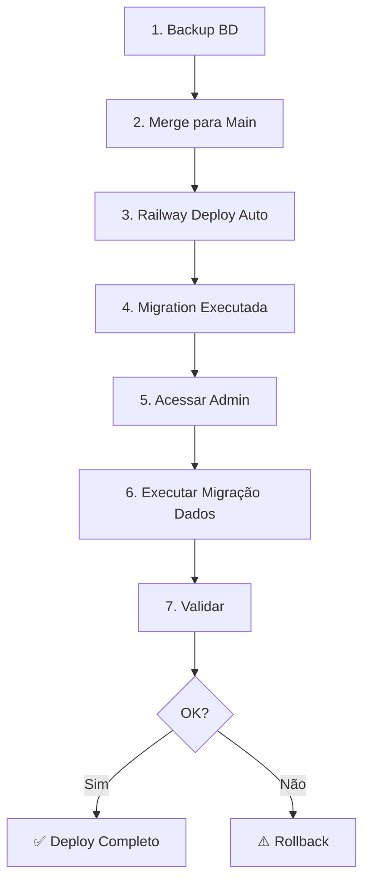

# 🚀 Guia de Deploy em Produção - Momentos de Pesquisa

## ⚠️ IMPORTANTE

Este guia descreve o deploy DIRETO em produção da feature "Momentos de Pesquisa".

**Riscos Minimizados:**
- ✅ Migration compatível com dados existentes
- ✅ Campo `surveyMomentId` é opcional (nullable)
- ✅ Formulários existentes continuam funcionando
- ✅ Zero downtime durante deploy
- ✅ Rollback disponível se necessário

---

## 📋 Pré-Requisitos

- [ ] Acesso ao Railway (Produção)
- [ ] Acesso ao repositório GitHub
- [ ] Backup do banco de dados feito
- [ ] Time informado sobre deploy
- [ ] Horário de baixo tráfego escolhido

---

## 🔄 Visão Geral do Deploy



---

## 📝 Passo a Passo Detalhado

### **Fase 1: Preparação (15 min)**

#### **1.1 Backup do Banco de Dados**

```bash
# Via Railway CLI
railway login
railway environment production

# Fazer backup
railway run pg_dump $DATABASE_URL > backup-momentos-$(date +%Y%m%d-%H%M%S).sql

# Verificar backup criado
ls -lh backup-momentos-*.sql
```

**Importante:** Guarde este backup em local seguro!

#### **1.2 Verificar Branch**

```bash
# Verificar se está na branch correta
git branch

# Deve mostrar: claude/survey-moments-structure-011CUzvYqawdBPmyRzZ95qRk

# Verificar commits
git log --oneline -5
```

#### **1.3 Comunicar Time**

Envie mensagem para o time:
> 🚀 **Deploy Programado**
>
> Feature: Momentos de Pesquisa
> Horário: [DATA/HORA]
> Downtime esperado: 0 minutos
> Impacto: Nenhum para usuários finais

---

### **Fase 2: Deploy (10 min)**

#### **2.1 Merge para Main**

```bash
# Ir para main
git checkout main

# Atualizar main
git pull origin main

# Merge da feature branch
git merge claude/survey-moments-structure-011CUzvYqawdBPmyRzZ95qRk

# Verificar se merge foi limpo
git status
```

#### **2.2 Criar Tag de Versão**

```bash
# Criar tag
git tag -a v1.2.0-momentos -m "Release: Sistema de Momentos de Pesquisa"

# Ver tags
git tag
```

#### **2.3 Push para Produção**

```bash
# Push com tags
git push origin main --tags
```

**O que acontece automaticamente:**
1. ✅ Railway detecta push na main
2. ✅ Inicia build automático
3. ✅ Executa: `npm ci && npx prisma generate && npm run build`
4. ✅ Executa: `npx prisma migrate deploy` (aplica migration)
5. ✅ Inicia: `npm start`

#### **2.4 Monitorar Deploy**

```bash
# Ver logs em tempo real
railway logs --environment production --follow
```

**Aguardar mensagens:**
- ✅ `Build completed successfully`
- ✅ `Migration applied: 20251111000000_add_survey_moments`
- ✅ `Server started on port 3000`

---

### **Fase 3: Migration de Dados (5 min)**

#### **3.1 Acessar Painel Admin**

1. Acesse: `https://nps.sintegra.com.br/login`
2. Faça login como **Super Admin**
3. Vá para: **Configurações** → **Migração de Dados**

URL direta: `https://nps.sintegra.com.br/admin/settings/data-migration`

#### **3.2 Verificar Preview**

Você verá:
- 📊 Total de formulários
- ⚠️ Formulários pendentes de migração
- ✅ Formulários já migrados

Revise o preview da migração automática para verificar se a categorização está correta.

#### **3.3 Executar Migração**

1. Clique em **"Executar Migração Automática"**
2. Confirme na modal de confirmação
3. Aguarde conclusão (alguns segundos)
4. Verifique resultado

**Critérios de Migração Automática:**
- **Treinamento Cadáver Lab**: formulários com "treinamento", "lab", "cadáver", "curso"
- **Satisfação e Pós-Mercado**: todos os outros

#### **3.4 Validar Resultados**

Acesse: **Configurações** → **Momentos de Pesquisa**

Verifique:
- [ ] 2 momentos criados
- [ ] Quantidade de formulários em cada momento
- [ ] Cores e ícones corretos

---

### **Fase 4: Validação (10 min)**

#### **4.1 Smoke Tests**

Execute os seguintes testes:

**Teste 1: Visualizar Momentos**
```
✓ Acessar /admin/settings/survey-moments
✓ Ver 2 momentos listados
✓ Ver contagem de formulários
```

**Teste 2: Criar Novo Formulário**
```
✓ Acessar /admin/forms/new
✓ Ver campo "Momento de Pesquisa"
✓ Selecionar um momento
✓ Criar formulário com sucesso
```

**Teste 3: Formulários Existentes**
```
✓ Acessar /admin/forms
✓ Todos os formulários aparecem
✓ Nenhum erro de carregamento
```

**Teste 4: Respostas Continuam Funcionando**
```
✓ Acessar um link de formulário
✓ Preencher e submeter
✓ Ver resposta salva
```

#### **4.2 Verificar Logs**

```bash
# Verificar se não há erros
railway logs --environment production | grep ERROR

# Deve retornar vazio ou apenas warnings
```

#### **4.3 Verificar Métricas Railway**

No Railway Dashboard, verificar:
- [ ] CPU usage < 80%
- [ ] Memory usage < 80%
- [ ] Response time < 2s
- [ ] Sem erros 500

---

### **Fase 5: Comunicação e Monitoramento (30 min)**

#### **5.1 Avisar Time**

> ✅ **Deploy Concluído com Sucesso!**
>
> Feature: Momentos de Pesquisa
> Horário: [DATA/HORA]
> Status: ✅ Produção
> Migration: ✅ [X] formulários migrados
>
> **Novidades:**
> - Formulários agora organizados por momentos
> - 2 momentos iniciais criados
> - Migração automática executada
>
> **Para Super Admins:**
> - Acessar: Configurações → Momentos de Pesquisa
> - Gerenciar momentos existentes
> - Criar novos momentos conforme necessário

#### **5.2 Monitorar por 1 Hora**

```bash
# Deixar logs rodando
railway logs --environment production --follow

# Monitorar:
# - Erros de runtime
# - Tempo de resposta
# - Queries lentas
```

#### **5.3 Atualizar Documentação**

- [ ] Atualizar CHANGELOG.md
- [ ] Marcar versão no README
- [ ] Documentar novos recursos

---

## 🔙 Plano de Rollback

### **Se algo der errado:**

#### **Opção 1: Rollback via Git (Recomendado)**

```bash
# Reverter último commit
git revert HEAD

# Push
git push origin main

# Railway faz deploy automático do revert
```

#### **Opção 2: Rollback via Railway UI**

1. Acessar Railway Dashboard
2. Ir em **Deployments**
3. Selecionar deployment anterior (antes da migration)
4. Clicar em **"Redeploy"**

#### **Opção 3: Restaurar Banco (Último Recurso)**

⚠️ **CUIDADO: Isso apaga dados novos!**

```bash
# Restaurar backup
psql $DATABASE_URL < backup-momentos-YYYYMMDD-HHMMSS.sql

# Reverter migration
railway run npx prisma migrate resolve --rolled-back 20251111000000_add_survey_moments
```

---

## 📊 Checklist Final

### **Pré-Deploy**
- [ ] Backup do banco feito
- [ ] Branch testada localmente
- [ ] Time avisado sobre deploy
- [ ] Horário de baixo tráfego escolhido

### **Durante Deploy**
- [ ] Merge para main limpo
- [ ] Tag de versão criada
- [ ] Push bem-sucedido
- [ ] Build completou sem erros
- [ ] Migration executada
- [ ] Servidor iniciou

### **Pós-Deploy**
- [ ] Migração de dados executada
- [ ] Smoke tests passaram
- [ ] Logs sem erros críticos
- [ ] Métricas normais
- [ ] Time avisado de conclusão

### **Validação Completa**
- [ ] Momentos criados (2)
- [ ] Formulários migrados
- [ ] Criar novo formulário funciona
- [ ] Respostas funcionam normalmente
- [ ] Dashboard carrega sem erros

---

## 🆘 Troubleshooting

### **Migration Falhou**

```bash
# Ver status
railway run npx prisma migrate status

# Tentar aplicar manualmente
railway run npx prisma migrate deploy

# Se persistir, reverter
railway run npx prisma migrate resolve --rolled-back 20251111000000_add_survey_moments
```

### **Formulários Não Carregam**

1. Verificar logs: `railway logs --environment production | grep ERROR`
2. Verificar conexão com banco
3. Limpar cache do browser
4. Testar em navegador anônimo

### **Migração de Dados Falhou**

1. A migração pode ser executada novamente
2. Formulários sem momento continuam funcionando
3. Pode ser feita manualmente depois

### **Performance Degradada**

1. Verificar CPU/Memory no Railway
2. Verificar queries lentas
3. Considerar adicionar índices se necessário
4. Rollback se crítico

---

## 📞 Contatos de Emergência

**Railway Status:**
https://status.railway.app/

**Prisma Discord:**
https://discord.gg/prisma

**Time Interno:**
- Tech Lead: [adicionar]
- DBA: [adicionar]
- DevOps: [adicionar]

---

## 📈 Métricas de Sucesso

Após 24 horas, verificar:
- [ ] Uptime: > 99.9%
- [ ] Tempo de resposta: < 2s
- [ ] Taxa de erro: < 0.1%
- [ ] Formulários funcionando: 100%
- [ ] Migrações completadas: 100%

---

## 🎯 Próximos Passos

Após deploy bem-sucedido:

1. **Treinar equipe:**
   - Como criar momentos
   - Como categorizar formulários
   - Como visualizar dados por momento

2. **Melhorias futuras:**
   - Dashboard filtrado por momento
   - Relatórios por momento
   - Analytics por contexto
   - Comparação entre momentos

3. **Monitoramento:**
   - Criar alertas para erros
   - Monitorar uso da feature
   - Coletar feedback dos usuários

---

## 📝 Registro de Deploy

**Data do Deploy:** __/__/____
**Hora Início:** __:__
**Hora Fim:** __:__
**Executado por:** _____________
**Status:** [ ] Sucesso [ ] Parcial [ ] Rollback

**Formulários Migrados:** ____
**Tempo Total:** ____ minutos

**Observações:**
_______________________________________
_______________________________________
_______________________________________

**Assinatura:** _____________

---

**Última atualização:** 2025-11-11
**Versão:** 1.0
**Autor:** Claude Code (Anthropic)
