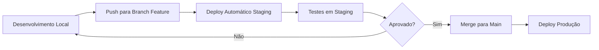

# 🧪 Guia de Configuração - Ambiente de Homologação (Staging)

## 📋 Visão Geral

Este guia detalha como configurar um ambiente de homologação separado no Railway para testar a nova funcionalidade de **Momentos de Pesquisa** antes do deploy em produção.

---

## 🎯 Objetivos

- ✅ Criar ambiente isolado para testes
- ✅ Banco de dados PostgreSQL separado
- ✅ URL exclusiva para staging
- ✅ Zero impacto no ambiente de produção
- ✅ Facilitar testes e validações

---

## 🚀 Passo a Passo - Configuração no Railway

### **1. Acessar o Dashboard do Railway**

1. Acesse: https://railway.app/
2. Faça login na sua conta
3. Localize o projeto atual: **NPS-Síntegra**

---

### **2. Criar Novo Ambiente (Staging)**

**Opção A: Via Interface Web**

1. No projeto, clique em **"Settings"** (engrenagem)
2. Vá até a seção **"Environments"**
3. Clique em **"+ New Environment"**
4. Nomeie como: `staging`
5. Clique em **"Create Environment"**

**Opção B: Via Railway CLI**

```bash
# Instalar Railway CLI (se ainda não tiver)
npm install -g @railway/cli

# Login
railway login

# Link ao projeto
railway link

# Criar ambiente staging
railway environment create staging
```

---

### **3. Criar Banco de Dados PostgreSQL para Staging**

1. No Railway, certifique-se de estar no ambiente **staging**
2. Clique em **"+ New"** → **"Database"** → **"Add PostgreSQL"**
3. Aguarde o provisionamento (1-2 minutos)
4. O Railway vai gerar automaticamente a `DATABASE_URL`

**Importante:** Este banco será SEPARADO do banco de produção!

---

### **4. Configurar Serviço Frontend Staging**

1. No ambiente **staging**, clique em **"+ New"** → **"GitHub Repo"**
2. Selecione o repositório: `gfcampos1/NPS-Síntegra`
3. Configure o serviço:
   - **Name:** `nps-sintegra-frontend-staging`
   - **Branch:** `claude/survey-moments-structure-011CUzvYqawdBPmyRzZ95qRk`
   - **Root Directory:** `frontend`
   - **Build Command:** (deixar padrão - usará railway.json)
   - **Start Command:** (deixar padrão - usará railway.json)

---

### **5. Configurar Variáveis de Ambiente - Staging**

No serviço frontend staging, adicione as seguintes variáveis:

#### **5.1 Database**

```bash
DATABASE_URL=${{Postgres.DATABASE_URL}}
```
*Nota: O Railway conecta automaticamente se o Postgres estiver no mesmo projeto*

#### **5.2 NextAuth**

```bash
NEXTAUTH_URL=${{RAILWAY_PUBLIC_DOMAIN}}
NEXTAUTH_SECRET=<GERAR_NOVA_SECRET_STAGING>
```

**Gerar nova secret:**
```bash
openssl rand -base64 32
```

#### **5.3 Email (Resend) - OPCIONAL para staging**

```bash
RESEND_API_KEY=<sua_api_key_resend>
RESEND_FROM_EMAIL=nps-staging@sintegra.com.br
RESEND_FROM_NAME="Síntegra NPS [STAGING]"
```

**Alternativa:** Usar modo de teste sem enviar emails reais

#### **5.4 App Config**

```bash
NEXT_PUBLIC_APP_URL=${{RAILWAY_PUBLIC_DOMAIN}}
NEXT_PUBLIC_API_URL=${{RAILWAY_PUBLIC_DOMAIN}}/api
NODE_ENV=staging
```

#### **5.5 Feature Flags (Staging)**

```bash
NEXT_PUBLIC_ENABLE_PWA=false
NEXT_PUBLIC_ENABLE_ANALYTICS=false
NEXT_PUBLIC_ENABLE_DARK_MODE=false
```

#### **5.6 NPS Config**

```bash
NPS_TARGET_MEDICOS=50
NPS_TARGET_DISTRIBUIDORES=60
NPS_RESPONSE_EXPIRATION_DAYS=30
NPS_MAX_REMINDERS=3
```

#### **5.7 Rate Limiting**

```bash
RATE_LIMIT_MAX_REQUESTS=10
RATE_LIMIT_WINDOW_MS=60000
```

---

### **6. Configurar Domínio Staging**

#### **Via Railway (Automático)**

1. O Railway gera automaticamente um domínio público
2. Exemplo: `nps-sintegra-staging-production-xxxx.up.railway.app`
3. Este domínio é usado nas variáveis `${{RAILWAY_PUBLIC_DOMAIN}}`

#### **Via Domínio Customizado (Opcional)**

1. Em **Settings** → **Domains**
2. Adicionar custom domain: `staging.nps-sintegra.com.br`
3. Configurar DNS conforme instruções do Railway

---

### **7. Deploy Inicial**

#### **Via Railway UI**

1. No serviço staging, clique em **"Deploy"**
2. Selecione o branch: `claude/survey-moments-structure-011CUzvYqawdBPmyRzZ95qRk`
3. Aguarde o build e deploy (5-10 minutos)

#### **Via Railway CLI**

```bash
# Selecionar ambiente staging
railway environment staging

# Deploy
railway up
```

---

### **8. Executar Migrations (Primeira vez)**

Após o deploy inicial, as migrations rodam automaticamente via:
```json
"startCommand": "npx prisma migrate deploy && npm start"
```

Para verificar logs:
```bash
railway logs --environment staging
```

---

### **9. Popular Banco Staging com Dados de Teste**

#### **Opção A: Seed Script**

```bash
# Via Railway CLI
railway run --environment staging npm run db:seed
```

#### **Opção B: Copiar dados de Produção (sanitizados)**

```bash
# 1. Exportar dados de produção (sem dados sensíveis)
pg_dump -h <prod_host> -U <user> -d <db> \
  --exclude-table-data=users \
  --exclude-table-data=audit_logs \
  > staging_seed.sql

# 2. Importar para staging
psql $DATABASE_URL < staging_seed.sql
```

---

### **10. Criar Super Admin no Staging**

```bash
# Via Railway CLI
railway run --environment staging npm run db:seed

# OU via Prisma Studio
railway run --environment staging npx prisma studio
```

**Credenciais padrão (seed):**
- Email: `admin@sintegra.com.br`
- Senha: `Admin123!` (trocar após login)

---

## 🔍 Verificações Pós-Deploy

### **Checklist de Validação:**

- [ ] Serviço staging está rodando
- [ ] Banco PostgreSQL staging está conectado
- [ ] Login funciona com super admin
- [ ] Dashboard carrega sem erros
- [ ] Formulários aparecem corretamente
- [ ] Respostas aparecem no dashboard

### **URLs para Testar:**

```bash
# Home
https://<seu-dominio-staging>.up.railway.app

# Login
https://<seu-dominio-staging>.up.railway.app/login

# Dashboard Admin
https://<seu-dominio-staging>.up.railway.app/admin/dashboard

# Formulários
https://<seu-dominio-staging>.up.railway.app/admin/forms
```

---

## 🔧 Comandos Úteis - Railway CLI

```bash
# Ver status do ambiente
railway status --environment staging

# Ver logs em tempo real
railway logs --environment staging --follow

# Abrir shell no container
railway shell --environment staging

# Executar comando específico
railway run --environment staging <comando>

# Ver variáveis de ambiente
railway variables --environment staging

# Adicionar variável
railway variables set KEY=value --environment staging

# Restart do serviço
railway restart --environment staging
```

---

## 🧹 Troubleshooting

### **Problema: Build falhou**

```bash
# Ver logs detalhados
railway logs --environment staging

# Verificar se todas as variáveis estão configuradas
railway variables --environment staging

# Rebuild
railway redeploy --environment staging
```

### **Problema: Migrations falharam**

```bash
# Acessar shell
railway shell --environment staging

# Verificar status
npx prisma migrate status

# Aplicar migrations manualmente
npx prisma migrate deploy

# Reset (CUIDADO: apaga dados)
npx prisma migrate reset --force
```

### **Problema: Database não conecta**

```bash
# Verificar variável DATABASE_URL
railway variables --environment staging | grep DATABASE

# Testar conexão
railway run --environment staging npx prisma db pull
```

### **Problema: Login não funciona**

- Verificar `NEXTAUTH_SECRET` está configurado
- Verificar `NEXTAUTH_URL` aponta para domínio correto
- Verificar se super admin foi criado no banco staging

---

## 📊 Monitoramento

### **Métricas do Railway**

1. No dashboard staging, clique em **"Metrics"**
2. Monitore:
   - CPU Usage
   - Memory Usage
   - Network Traffic
   - Disk Usage (Postgres)

### **Logs**

```bash
# Logs do serviço frontend
railway logs --environment staging --service frontend

# Logs do database
railway logs --environment staging --service postgres
```

---

## 🔒 Segurança - Staging

### **Boas Práticas:**

1. **Nunca** usar credenciais de produção em staging
2. **Sempre** usar API keys separadas (Resend, Cloudinary, etc)
3. **Considerar** adicionar autenticação básica HTTP:

```bash
# Adicionar proteção básica (opcional)
BASIC_AUTH_USER=staging
BASIC_AUTH_PASSWORD=<senha_forte>
```

4. **Evitar** dados sensíveis de clientes reais
5. **Usar** dados fictícios para testes

---

## 🔄 Fluxo de Deploy - Staging → Production



---

## 📝 Próximos Passos

Após configurar staging:

1. ✅ Testar ambiente staging básico
2. ✅ Implementar feature "Momentos de Pesquisa"
3. ✅ Testar em staging
4. ✅ Validar com stakeholders
5. ✅ Deploy para produção

---

## 📞 Suporte

**Problemas com Railway:**
- Docs: https://docs.railway.app/
- Discord: https://discord.gg/railway
- Status: https://status.railway.app/

**Problemas com Prisma:**
- Docs: https://www.prisma.io/docs/
- Discord: https://discord.gg/prisma

---

## 📌 Recursos Adicionais

- [Railway Environments](https://docs.railway.app/develop/environments)
- [Railway CLI Reference](https://docs.railway.app/develop/cli)
- [Prisma Migrations](https://www.prisma.io/docs/concepts/components/prisma-migrate)
- [Next.js Deploy Railway](https://docs.railway.app/guides/nextjs)

---

**Última atualização:** 2025-11-10
**Versão:** 1.0
**Autor:** Claude (Anthropic)
